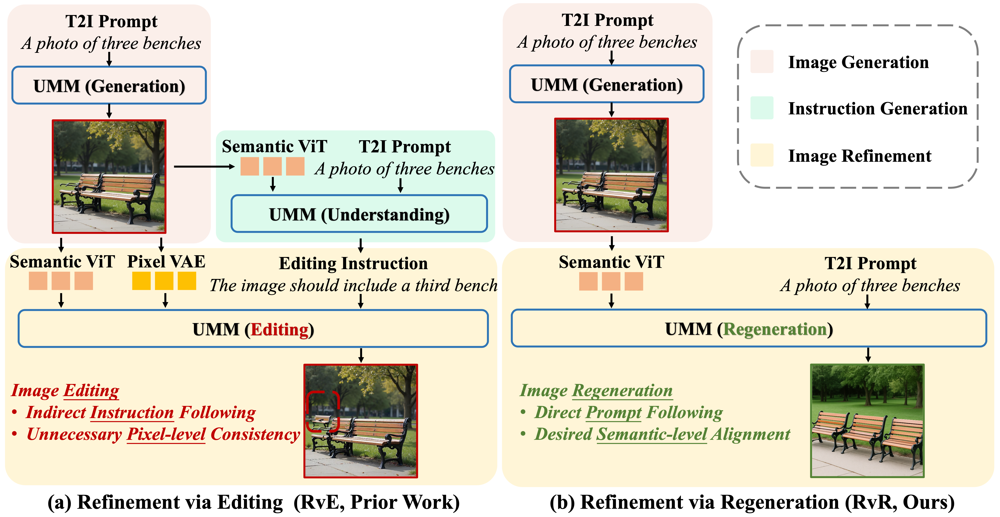
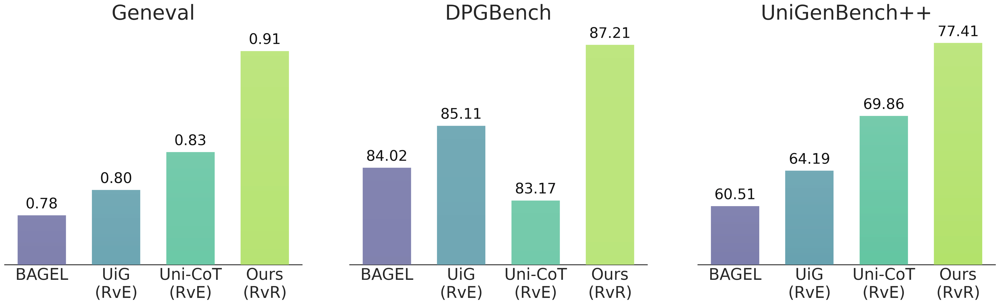

<p align="center">
  
</p>

<p align="center">
  <a href="https://arxiv.org/abs/2604">
    
  </a>
  <a href="https://huggingface.co/JiayiGuo821/RvR-7B-MoT">
    
  </a>
</p>

# Enlarging Modification Space Boosts Image Refinement in Unified Multimodal Models
> [Jiayi Guo](https://www.jiayiguo.net),
> [Linqing Wang](https://scholar.google.com/citations?user=Hy12lcEAAAAJ&hl=en),
> [Jiangshan Wang](https://scholar.google.com/citations?user=HoKoCv0AAAAJ&hl=en),
> [Yang Yue](https://scholar.google.com/citations?user=Q9cLkdcAAAAJ&hl=en),
> [Zeyu Liu](https://scholar.google.com/citations?user=55tpKaoAAAAJ&hl=en),
> [Zhiyuan Zhao](https://openreview.net/profile?id=~Zhiyuan_Zhao3),
> [Qinglin Lu](https://openreview.net/profile?id=~Qinglin_Lu2),  
> [Gao Huang](https://www.gaohuang.net),
> [Chunyu Wang ✉️](https://scholar.google.com/citations?user=VXQV5xwAAAAJ&hl=en)
>
> Tsinghua University &nbsp;·&nbsp; Tencent Hunyuan (HY)
>
> We present Refinement via Regeneration (RvR), a novel framework that reformulates image refinement in unified multimodal models from an editing-based paradigm to a regeneration-based one. Instead of relying on intermediate editing instructions and enforcing pixel-level consistency, our method directly regenerates images conditioned on the target prompt and semantic representations of the initial image, thereby enlarging the effective modification space. This design enables more complete semantic alignment and avoids error accumulation from coarse instructions, leading to more flexible and accurate refinement.

The figure below shows representative examples before and after refinement with RvR.
<p align="center"></p>

## 👀 Overview
 Prior Refinement via Editing (RvE) requires precise instruction generation and content consistency in unedited regions. In contrast, RvR discards these constraints and enlarges the modification space for better refinement.
<p align="center"></p>

## 📢 News
- **April 28, 2026:** We released the official [report]() and [model](https://huggingface.co/JiayiGuo821/RvR-7B-MoT).

## 🔥 Quick Start

1️⃣ Set up the environment
```bash
git clone https://github.com/LeapLabTHU/RvR.git
cd RvR
conda create -n rvr python=3.10 -y
conda activate rvr
pip install -r requirements.txt
pip install flash_attn==2.5.8 --no-build-isolation
```

2️⃣ Download the pretrained checkpoint
```python
from huggingface_hub import snapshot_download

save_dir = "models/RvR-7B-MoT"
repo_id = "JiayiGuo821/RvR-7B-MoT"
cache_dir = save_dir + "/cache"

snapshot_download(cache_dir=cache_dir,
  local_dir=save_dir,
  repo_id=repo_id,
  local_dir_use_symlinks=False,
  resume_download=True,
  allow_patterns=["*.json", "*.safetensors", "*.bin", "*.py", "*.md", "*.txt"],
)
```

3️⃣ Launch the Gradio WebUI and start playing with RvR!
```bash
python app.py
```

## 🤖 Train & Eval
### Train
We provide our training script together with a toy dataset.

1️⃣ Download the toy dataset
```bash
wget -O toy_data.zip https://huggingface.co/datasets/JiayiGuo821/RvR-Data/resolve/main/toy_data.zip && unzip toy_data.zip
```

2️⃣ Download BAGEL
```python
from huggingface_hub import snapshot_download

save_dir = "models/BAGEL-7B-MoT"
repo_id = "ByteDance-Seed/BAGEL-7B-MoT"
cache_dir = save_dir + "/cache"

snapshot_download(cache_dir=cache_dir,
  local_dir=save_dir,
  repo_id=repo_id,
  local_dir_use_symlinks=False,
  resume_download=True,
  allow_patterns=["*.json", "*.safetensors", "*.bin", "*.py", "*.md", "*.txt"],
)
```

3️⃣ Launch the training script
```bash
bash scripts/train.sh
```

### Eval
(Optional) Download initial images (before refinement) generated by BAGEL / RvR
```bash
wget -O benchmarks.zip https://huggingface.co/datasets/JiayiGuo821/RvR-Data/resolve/main/benchmarks.zip && unzip benchmarks.zip
```

1️⃣ Geneval: Set up the `geneval` environment and download checkpoints following [this guide](https://github.com/djghosh13/geneval/issues/12)
```bash
bash scripts/eval/run_geneval.sh
conda activate geneval
bash scripts/eval/eval_geneval.sh
```
2️⃣ DPGBench: Set up the `dpg` environment following [this guide](https://github.com/HorizonWind2004/reconstruction-alignment/tree/main/Benchmark)
```bash
bash scripts/eval/run_dpg.sh
conda activate dpg
bash scripts/eval/eval_dpg.sh
```
3️⃣ UniGenBench++: Evaluate the generated images via the Gemini-2.5 Pro API following [this guide](https://github.com/CodeGoat24/UniGenBench)
```bash
bash scripts/eval/run_unigen.sh
```

## 📊 Benchmarks
<p align="center"></p>


## 🎩 Acknowledgements

Our code is built upon [BAGEL](https://github.com/ByteDance-Seed/Bagel).


## ✍️ Citation

```bibtex

```
